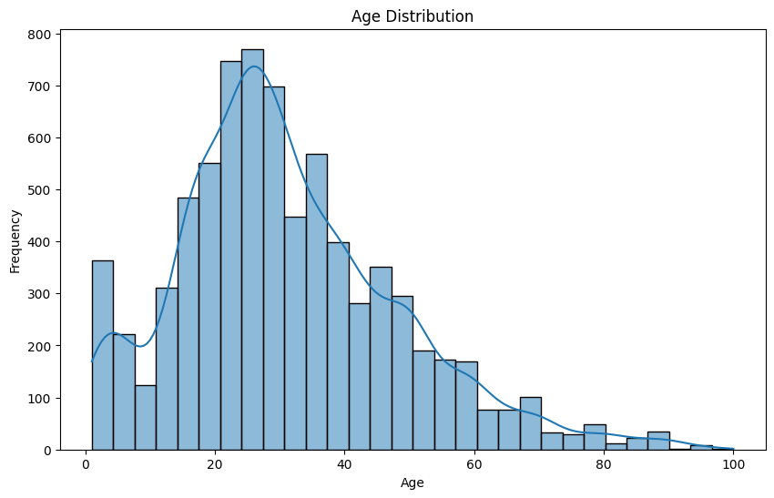

# Project 2: Computer Vision for Age Estimation

## Table of Contents
- [Introduction](#introduction)
- [Data Preparation](#data-preparation)
- [Exploratory Data Analysis (EDA)](#exploratory-data-analysis-eda)
- [Model Development](#model-development)
- [Training and Evaluation](#training-and-evaluation)
- [Results and Conclusions](#results-and-conclusions)
- [Future Improvements](#future-improvements)

## Introduction
The goal of this project was to create a computer vision model to estimate the age of individuals purchasing alcohol at Good Seed supermarket, ensuring compliance with age verification laws.

## Data Preparation
The dataset contained 7,600 images with corresponding age labels. Images were preprocessed using `ImageDataGenerator` for efficient loading and augmentation. Key data sources:
- `final_files` folder: Contains 7.6k photos.
- `labels.csv`: File with image filenames and real ages.

## Exploratory Data Analysis (EDA)
### Age Distribution
  
The histogram of age distribution showed a varied range of ages. Some age groups were overrepresented, potentially affecting model performance.

### Sample Images by Age
Sample images from different age groups were visualized to understand facial variations.

## Model Development
The model was built using the MobileNetV2 architecture with adjustments to suit the task:
- **Base Model:** MobileNetV2 (pre-trained on ImageNet)
- **Layers Added:** Global Average Pooling, Dropout, Dense (ReLU activation)
- **Optimizer:** Adam with a learning rate of 0.0001
- **Loss Function:** Mean Absolute Error (MAE)

## Training and Evaluation
The model was trained for 20 epochs with an MAE target of less than 8. The results were:
- **Training MAE:** 6.57
- **Validation MAE:** 7.65

## Results and Conclusions
The model met the performance target, showing potential for real-world application in the supermarket for age verification:
- **Operational Impact:** Real-time age estimation reduces the risk of legal issues related to alcohol sales.
- **Efficiency:** The chosen architecture is suitable for resource-constrained environments.

## Future Improvements
- **Data Augmentation:** Additional augmentation techniques to improve model generalization.
- **Class Imbalance Handling:** Techniques like oversampling or re-weighting the loss function could improve performance on underrepresented age groups.
- **Model Architecture:** Experimenting with different architectures like EfficientNet.

